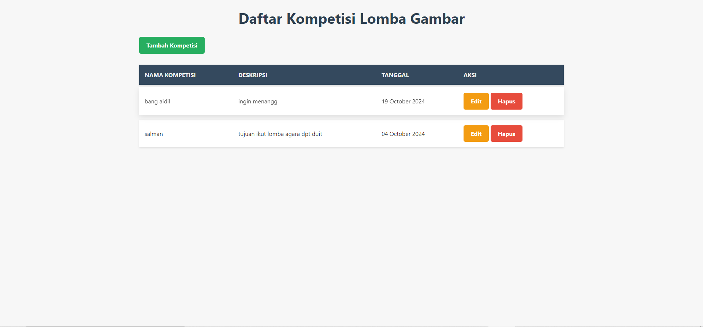

# Aplikasi pendaftaran lomba gambar #

## deskripsi ##

### Aplikasi Pendaftaran Lomba Gambar adalah aplikasi berbasis web yang digunakan untuk mengelola kompetisi lomba gambar. Aplikasi ini memungkinkan admin untuk membuat kompetisi baru, mendaftarkan peserta, serta menampilkan daftar kompetisi dan peserta. Aplikasi ini dibuat menggunakan PHP, MySQL, HTML, dan CSS. ###

## fitur utaman ##

- Tambah Kompetisi: Admin dapat menambahkan kompetisi baru dengan deskripsi dan tanggal pelaksanaan.

- Daftar Peserta: Menampilkan daftar peserta yang mendaftar untuk setiap kompetisi.

- Tambah Peserta: Form untuk mendaftarkan peserta baru ke kompetisi yang dipilih.

- Edit dan Hapus: Admin dapat mengedit atau menghapus kompetisi dan peserta yang sudah didaftarkan.

- Relasi Kompetisi dan Peserta: Peserta didaftarkan ke kompetisi tertentu, yang terhubung dengan tabel competitions.

